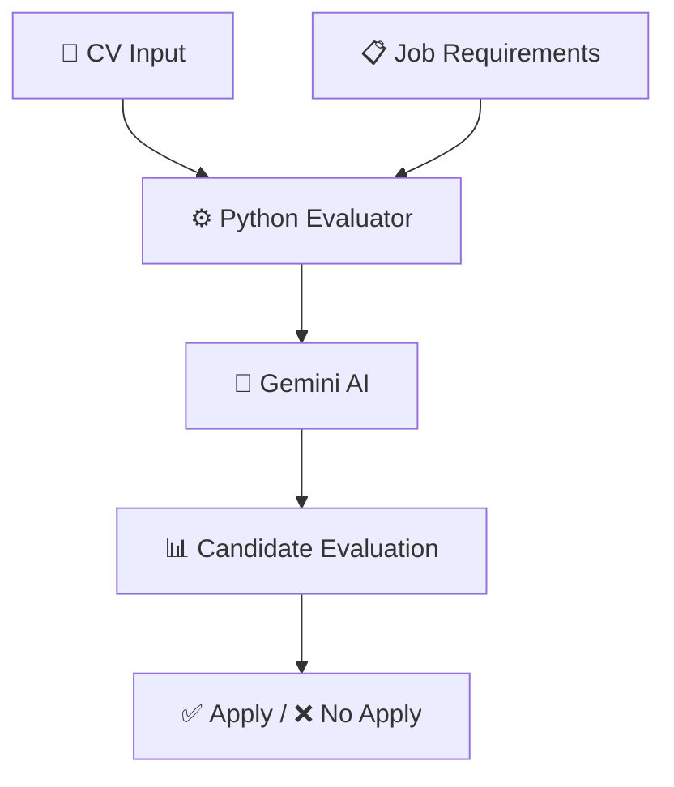

# 🤖 AI CV Evaluator Agent

<p align="center">
  
  
  
  
</p>

<p align="center">
  <b>An AI-powered recruitment assistant that compares CVs against job requirements and determines candidate fit.</b>
</p>

---

## ✨ Features

✅ Compare a **CV** against **job requirements**  
✅ Determine if a candidate **applies or not**  
✅ Generate an **AI score (0–100)**  
✅ Identify **strengths and skill gaps**  
✅ Easy to extend into **FastAPI + React web app**  
✅ Built using **Gemini AI + Python**

---

## 🏗️ Architecture



---

## 📁 Project Structure

```txt
ai-cv-evaluator-agent/
│
├── app/
│   ├── main.py
│   ├── evaluator.py
│   ├── cv_reader.py
│   └── schemas.py
│
├── inputs/
│   ├── cv.txt
│   └── job_requirements.txt
│
├── .env
├── requirements.txt
└── README.md
```

---

## ⚙️ Installation

### 1. Clone the repository

```bash
git clone https://github.com/yourusername/ai-cv-evaluator-agent.git

cd ai-cv-evaluator-agent
```

### 2. Create virtual environment

```bash
python -m venv venv
```

Activate environment:

**Windows**

```bash
venv\Scripts\activate
```

**Mac/Linux**

```bash
source venv/bin/activate
```

### 3. Install dependencies

```bash
pip install -r requirements.txt
```

---

## 💻 Running the Project

After setting up the environment and API key, run the application from the project root directory.

### 1. Activate the virtual environment

**Windows**

```bash
venv\Scripts\activate
```

**Mac/Linux**

```bash
source venv/bin/activate
```

You should now see something like:

```bash
(venv)
```

in your terminal.

---

### 2. Make sure your input files exist

Add the candidate CV here:

```txt
inputs/cv.txt
```

Add the job requirements here:

```txt
inputs/job_requirements.txt
```

---

### 3. Run the application

From the project root folder:

```bash
python -m app.main
```

If everything is configured correctly, you should see an output similar to:

```txt
=== CV EVALUATION RESULT ===

Applies: Yes
Score: 82/100

Verdict:
Candidate meets most requirements.

Strengths:
- Strong backend experience
- PostgreSQL knowledge

Gaps:
- Missing Django experience

Recommendation:
Proceed to technical interview.
```

---

### 4. Common Issues

#### Virtual environment not activated

If Python packages are missing, activate the virtual environment first:

```bash
venv\Scripts\activate
```

#### Gemini API key error

Verify your `.env` file exists and contains:

```env
GEMINI_API_KEY=your_api_key_here
```

#### Missing dependencies

Reinstall project packages:

```bash
pip install -r requirements.txt
```

---

## 🔑 Gemini API Setup

This project uses **Google Gemini API**.

Get your free API key here:

👉 https://aistudio.google.com/app/apikey

Create a `.env` file:

```env
GEMINI_API_KEY=your_api_key_here
```

---

## ▶️ Usage

### Step 1: Add CV

Paste the candidate resume into:

```txt
inputs/cv.txt
```

### Step 2: Add Job Requirements

Paste the job description into:

```txt
inputs/job_requirements.txt
```

### Step 3: Run the project

```bash
python -m app.main
```

---

## 📊 Example Output

```txt
=== CV EVALUATION RESULT ===

Applies: Yes
Score: 82/100

Verdict:
Candidate meets most technical requirements.

Strengths:
- Strong backend experience
- PostgreSQL knowledge
- API development

Gaps:
- No Django experience
- Limited LLM production experience

Recommendation:
Proceed to technical interview.
```

---

## 🧰 Tech Stack

| Technology | Purpose |
|------------|---------|
| Python | Core Logic |
| Gemini AI | LLM Evaluation |
| Pydantic | Structured Validation |
| dotenv | Environment Variables |
| VSCode | Development |

---

## 🚀 Future Improvements

- [ ] PDF CV support  
- [ ] DOCX parsing  
- [ ] FastAPI backend  
- [ ] React frontend  
- [ ] Batch candidate analysis  
- [ ] Recruiter dashboard  
- [ ] Multi-job evaluation

---

## 👨‍💻 Author

Built with ❤️ by **Joel Abril**

GitHub: `@JoelAbrilM`
